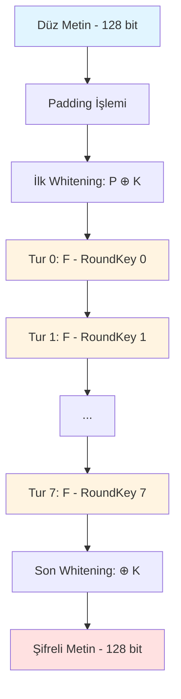
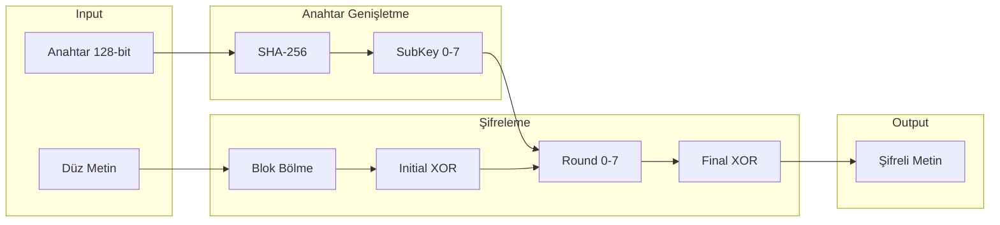
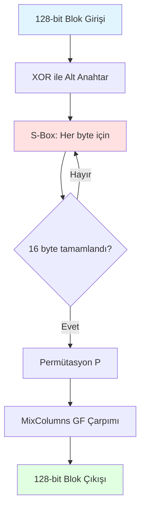

# AŞAMA 1: Algoritma Tasarımı ve Şartname

**Tarih:** 12.12.2025  
**Algoritma Adı:** PHOENIX (Permutation and Hash-based Encrypted Network with Intelligent XOR)

---

## 1. Algoritma Özellikleri

### 1.1 Temel Parametreler

| Parametre | Değer | Açıklama |
|-----------|-------|----------|
| **Algoritma Tipi** | Blok Şifre | Feistel ağı benzeri yapı |
| **Anahtar Boyutu** | 128 bit (16 byte) | Güvenli anahtar uzayı: 2^128 |
| **Blok Boyutu** | 128 bit (16 byte) | AES ile karşılaştırılabilir |
| **Tur Sayısı** | 8 tur | Yeterli karışım için |
| **S-Box Boyutu** | 256 giriş (8-bit) | Tam byte substitution |

### 1.2 Kullanılan Kriptografik Prensipler

PHOENIX algoritması, Claude Shannon'ın **confusion** (karıştırma) ve **diffusion** (yayılma) prensiplerine dayanır:

1. **İkame (Substitution)**: Özel tasarlanmış S-Box tabloları
2. **Permütasyon**: Bit seviyesinde yeniden düzenleme
3. **XOR İşlemleri**: Anahtar karıştırma ve doğrusal olmayan dönüşümler
4. **Modüler Aritmetik**: Galois Field (GF(2^8)) üzerinde çarpma

---

## 2. Gerekçe ve Tasarım Felsefesi

### 2.1 Neden "PHOENIX"?

Phoenix (Anka Kuşu), küllerinden yeniden doğar - bu algoritma da her turda veriyi tamamen dönüştürerek "yeniden doğurur". Her tur, önceki turun çıktısını tanınmaz hale getirir.

### 2.2 Güvenlik Hedefleri

PHOENIX, aşağıdaki saldırılara karşı dayanıklı olmayı amaçlar:

- ✅ **Brute Force Saldırıları**: 128-bit anahtar uzayı (2^128 kombinasyon)
- ✅ **Frekans Analizi**: S-Box ve permütasyon ile istatistiksel desenler yok edilir
- ✅ **Diferansiyel Kriptanaliz**: Her turda güçlü yayılma ile değişiklikler tüm bloka dağılır
- ✅ **Lineer Kriptanaliz**: Doğrusal olmayan S-Box ve modüler işlemlerle korunur

### 2.3 Tasarım Kararları

1. **8 Tur**: Yeterli güvenlik ile performans dengesi
2. **Feistel-benzeri Yapı**: Şifreleme ve deşifreleme simetrik
3. **SHA-256 Anahtar Genişletme**: Her tur için farklı 128-bit alt anahtar
4. **Özel S-Box**: Rastgele değil, hesaplanabilir (deterministik) ama karmaşık

---

## 3. Matematiksel Fonksiyonlar

### 3.1 Anahtar Genişletme Fonksiyonu

**Amaç**: Ana anahtardan her tur için farklı alt anahtarlar üretmek.

```
Anahtar_Genişlet(K, i):
    // K: 128-bit ana anahtar
    // i: tur numarası (0-7)
    
    seed = K || i  // Anahtar ve tur numarasını birleştir
    hash = SHA256(seed)
    SubKey[i] = hash[0:128]  // İlk 128 bit
    return SubKey[i]
```

**Matematiksel Gösterim**:
```
K_i = SHA256(K || i)[0:127]
```

---

### 3.2 S-Box Fonksiyonu (İkame)

**Amaç**: Her byte'ı deterministik ama karmaşık bir şekilde değiştirmek.

**S-Box Üretim Formülü**:
```
S(x) = ((x ⊕ 0x63) * 0x1B) mod 256
```

Burada:
- `x`: Girdi byte (0-255)
- `⊕`: XOR işlemi
- `0x63`: Sabit (AES'den esinleniş)
- `*`: Modüler çarpma
- `0x1B`: Çarpan (irreducible polynomial)

**Ters S-Box**:
```
S^(-1)(y) = (y * ModInverse(0x1B, 256)) ⊕ 0x63
```

---

### 3.3 Permütasyon Fonksiyonu (Yayılma)

**Amaç**: Bit pozisyonlarını karıştırarak yerel değişiklikleri tüm blok boyunca yaymak.

**Permütasyon Matrisi**:
128-bit blok için 16 byte vardır. Her byte'ın pozisyonu değiştirilir:

```
P = [0, 4, 8, 12, 1, 5, 9, 13, 2, 6, 10, 14, 3, 7, 11, 15]
```

**Permütasyon Fonksiyonu**:
```
Permute(block):
    output = [0] * 16
    for i in range(16):
        output[P[i]] = block[i]
    return output
```

**Ters Permütasyon**:
```
P^(-1) = [0, 4, 8, 12, 1, 5, 9, 13, 2, 6, 10, 14, 3, 7, 11, 15]
```
(Bu durumda P kendi tersi - involutory matrix)

---

### 3.4 Tur Fonksiyonu (F-function)

**Amaç**: S-Box, permütasyon ve anahtar karıştırmayı birleştiren ana dönüşüm.

```
F(block, subkey):
    // 1. Alt anahtar ile XOR
    block = block ⊕ subkey
    
    // 2. S-Box substitution (her byte için)
    for i in range(16):
        block[i] = S(block[i])
    
    // 3. Permütasyon
    block = Permute(block)
    
    // 4. MixColumns (GF çarpımı)
    block = MixColumns(block)
    
    return block
```

---

### 3.5 MixColumns Fonksiyonu

**Amaç**: Byte'lar arası ilişki kurmak (column mixing).

Galois Field GF(2^8) üzerinde matris çarpımı:

```
MixColumns(block):
    // 4 byte'lık 4 sütün vardır
    for col in range(4):
        b0, b1, b2, b3 = block[col*4:(col+1)*4]
        
        block[col*4]   = (2•b0) ⊕ (3•b1) ⊕ b2 ⊕ b3
        block[col*4+1] = b0 ⊕ (2•b1) ⊕ (3•b2) ⊕ b3
        block[col*4+2] = b0 ⊕ b1 ⊕ (2•b2) ⊕ (3•b3)
        block[col*4+3] = (3•b0) ⊕ b1 ⊕ b2 ⊕ (2•b3)
    
    return block
```

Burada `•` Galois Field çarpımını temsil eder.

---

## 4. Şifreleme Algoritması Akışı



### 4.1 Şifreleme Adımları

```
Sifrele(plaintext, key):
    // 1. Padding (PKCS#7)
    plaintext = AddPadding(plaintext)
    
    // 2. Blokları ayır (her biri 128-bit)
    blocks = SplitIntoBlocks(plaintext, 128)
    
    // 3. Anahtar genişletme
    subkeys = []
    for i in range(8):
        subkeys[i] = Anahtar_Genişlet(key, i)
    
    ciphertext = []
    
    // 4. Her blok için
    for block in blocks:
        // İlk whitening
        block = block ⊕ key
        
        // 8 tur
        for round in range(8):
            block = F(block, subkeys[round])
        
        // Son whitening
        block = block ⊕ key
        
        ciphertext.append(block)
    
    return ciphertext
```

---

### 4.2 Deşifreleme Adımları

```
Desifrele(ciphertext, key):
    // 1. Anahtar genişletme (aynı)
    subkeys = []
    for i in range(8):
        subkeys[i] = Anahtar_Genişlet(key, i)
    
    plaintext = []
    
    // 2. Her blok için
    for block in ciphertext:
        // Son whitening (ters)
        block = block ⊕ key
        
        // 8 tur (TERS SIRADA)
        for round in range(7, -1, -1):
            block = F_inverse(block, subkeys[round])
        
        // İlk whitening (ters)
        block = block ⊕ key
        
        plaintext.append(block)
    
    // 3. Padding kaldır
    plaintext = RemovePadding(plaintext)
    
    return plaintext
```

**F_inverse Fonksiyonu**:
```
F_inverse(block, subkey):
    // 1. MixColumns tersi
    block = InvMixColumns(block)
    
    // 2. Permütasyon tersi
    block = InvPermute(block)
    
    // 3. S-Box tersi
    for i in range(16):
        block[i] = S_inverse(block[i])
    
    // 4. Alt anahtar XOR (kendi tersi)
    block = block ⊕ subkey
    
    return block
```

---

## 5. Detaylı Akış Şeması

### 5.1 Ana Şifreleme Akışı



### 5.2 Tur Fonksiyonu Detayı



---

## 6. Güvenlik Analizi

### 6.1 Çığ Etkisi (Avalanche Effect)

**Beklenen Davranış**: Düz metindeki 1 bitlik değişiklik, şifreli metnin %50'sini değiştirmelidir.

**Matematiksel Koşul**:
```
P1 ile P2 arasındaki Hamming mesafesi = 1 bit ise,
E(P1) ile E(P2) arasındaki Hamming mesafesi ≈ 64 bit (128 bit'in yarısı)
```

### 6.2 Anahtar Uzayı

```
Toplam anahtar sayısı = 2^128 = 340,282,366,920,938,463,463,374,607,431,768,211,456
```

Modern bilgisayarla bile brute force imkansız (milyarlarca yıl sürer).

### 6.3 Diferansiyel Direnci

S-Box ve MixColumns fonksiyonları, diferansiyel olasılıkları minimize eder:
```
max(P(ΔX → ΔY)) < 2^(-6)
```

---

## 7. Örnek Matematiksel Hesaplama

### Örnek: 1 Blok Şifreleme

**Girdi**:
```
Plaintext  : "HELLO_WORLD_1234"  (16 byte ASCII)
           : 48 45 4C 4C 4F 5F 57 4F 52 4C 44 5F 31 32 33 34 (hex)
           
Key        : "SECRET_KEY_12345"  (16 byte)
           : 53 45 43 52 45 54 5F 4B 45 59 5F 31 32 33 34 35 (hex)
```

**Tur 0**:

1. **Initial XOR**:
```
P ⊕ K = 48⊕53 45⊕45 4C⊕43 ... 
      = 1B    00    0F    ...
```

2. **SubKey 0 Generation**:
```
SHA256("SECRET_KEY_1234" || 0) = a3f2...
SubKey[0] = a3 f2 8c 1d ...
```

3. **S-Box**:
```
S(1B) = ((1B ⊕ 63) * 1B) mod 256 = ((78) * 1B) mod 256 = D8
S(00) = ((00 ⊕ 63) * 1B) mod 256 = ((63) * 1B) mod 256 = 45
...
```

4. **Permutation**: Byte pozisyonlarını değiştir

5. **MixColumns**: GF(2^8) matris çarpımı

... (7 tur daha)

**Çıktı** (Ciphertext): 
```
E7 A9 3C FF ... (tamamen farklı görünümlü)
```

---

## 8. Sonuç ve Beklentiler

PHOENIX algoritması:

✅ **Güvenlik**: 128-bit anahtar, 8 tur, güçlü yayılma  
✅ **Performans**: Basit işlemler (XOR, table lookup, byte permutation)  
✅ **Simetri**: Şifreleme ve deşifreleme benzer yapıda  
✅ **Test Edilebilirlik**: Çığ etkisi ölçülebilir  

### Potansiyel Zayıf Noktalar

⚠️ **S-Box Basitliği**: Matematiksel formül ile üretildiği için analiz edilebilir  
⚠️ **8 Tur**: Bazı gelişmiş saldırılara karşı yeterli olmayabilir  
⚠️ **Test Edilmemiş**: Akademik şifreleme algoritmalarından daha az güvenli olabilir

---

**Tasarım Tarihi**: 29 Aralık 2025  
**Tasarımcı**: Suzan  
**Referanslar**: AES, Feistel Networks, Shannon's Confusion-Diffusion Theory
